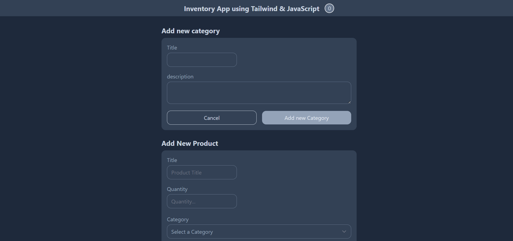

# Inventory App with OOP

## Project Screenshot



## Overview

This project is an inventory management system built using Object-Oriented Programming (OOP) principles. It allows users to manage categories and products with functionalities like adding, deleting, searching, and sorting products. The data is stored in the browser's `localStorage`.

## Features

- **Category Management**: Create and manage categories for products.
- **Product Management**: Add, delete, and update products in different categories.
- **Search**: Search for products by title.
- **Sort**: Sort products based on creation date (newest/oldest).
- **Local Storage**: All data (categories and products) are stored in the browser's `localStorage`.

## Tech Stack

- **HTML5**: Markup language for the web.
- **CSS3**: Styling language used with Tailwind CSS.
- **JavaScript**: Core logic and functionality.
- **Tailwind CSS**: Utility-first CSS framework.
- **PostCSS**: For processing CSS with PostCSS plugins.
- **Local Storage**: Data storage for persistent data across sessions.

---

### 📌 Live Demo

[Inventory App with OOP](https://aurora-inventory.netlify.app/)

---


## Installation

### Prerequisites

Make sure you have `Node.js` and `npm` installed on your machine. If not, you can download and install them from [here](https://nodejs.org/).

### Steps

1. Clone the repository:

   ```bash
   git clone https://github.com/auroraEros/Inventory-App-with-OOP.git
   cd Inventory-App-with-OOP
   ```

2. Install the dependencies:

   ```bash
   npm install
   ```

3. Start the development server to watch changes:

   ```bash
   npm run dev
   ```

4. Open the project in your browser at `http://localhost:3000` (or the relevant port displayed).

## Usage

- **Add Category**: Input the category title and description, then click the "Add New Category" button.
- **Add Product**: Choose a category, input product title and quantity, and click the "Add New Product" button.
- **Search Products**: Type in the search bar to filter products by title.
- **Sort Products**: Choose the sorting option (Newest or Oldest) to reorder the products.
- **Delete Product**: Click the "delete" button next to a product to remove it.

## File Structure

- `app.js`: Main file that handles the event listeners for categories and products.
- `categoryView.js`: Manages the creation and display of categories.
- `productView.js`: Handles the adding, displaying, searching, sorting, and deleting of products.
- `storage.js`: Manages the interactions with `localStorage`, saving and retrieving data for categories and products.
- `index.html`: The main HTML file for the application.
- `tailwind.css`: The compiled CSS file, generated from Tailwind CSS.

## License

This project is licensed under the ISC License - see the [LICENSE](LICENSE) file for details.
